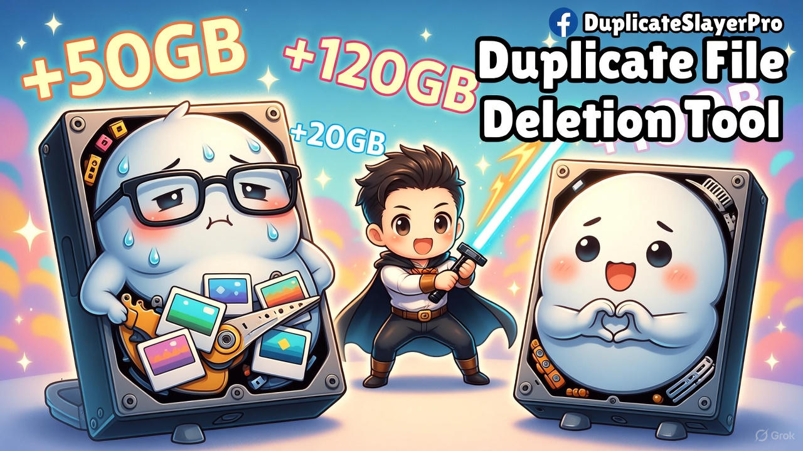
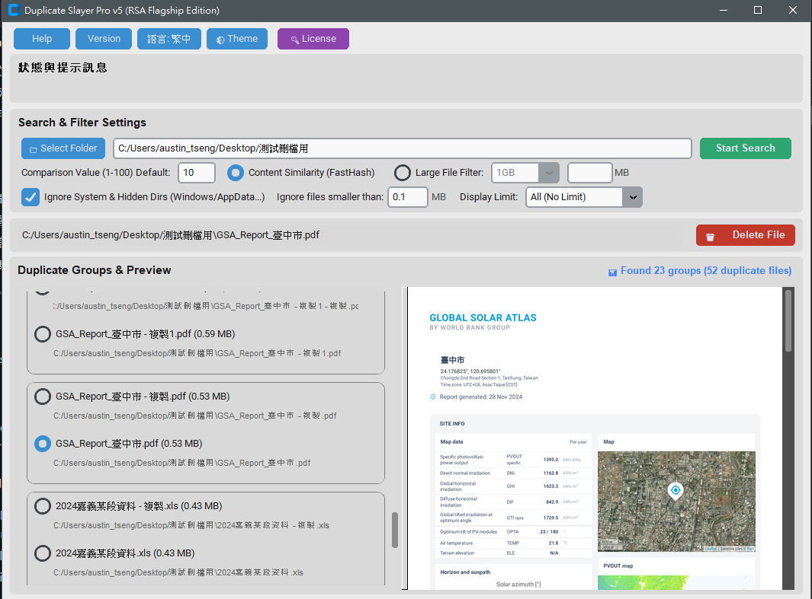

## 📥 下載與安裝
您可以前往 [最新發佈版本 (Releases)](https://github.com/wenfa43/DuplicateSlayerPro/releases/latest) 下載最新執行的程式檔：

* **DSP5_RSA.exe**
* 包含完整說明與 Releases 頁面：[點此前往](https://github.com/wenfa43/DuplicateSlayerPro/releases)

> 💡 **注意事項**：
> 1. 下載後請建立獨立資料夾，將 `DSP5_RSA.exe` 單獨放入該資料夾中執行。
> 2. 本程式完全離線運作，無任何連網功能。

## 📸 軟體Image

## 📖 詳細使用說明與教學
關於本工具的開發背景、詳細功能介紹及操作步驟，請參考我的部落格文章：
👉 [**DuplicateSlayerPro V4 詳細介紹與使用指南**](https://one4ok.blogspot.com/2026/03/duplicateslayerpro-v4.html)

## Google Play 下載(封測中,協助加入測試) DuplicateSlayerPro 副本刪檔神器

[**透過 Android 裝置加入測試**](https://play.google.com/store/apps/details?id=com.wenfa.duplicateslayerpro)

[**透過 網路 加入測試**](https://play.google.com/apps/testing/com.wenfa.duplicateslayerpro)

# Duplicate Slayer Pro v5 (副檔刪檔神器 V5) windows 電腦適用

## 程式簡介

Duplicate Slayer Pro v5 是一套專門的「重複檔案比對與刪除工具」，專為快速找出硬碟中重複的文件、圖片與影片所設計。
程式具備即時的多格式檔案與多頁面預覽功能(V5 版授權後解鎖播放功能)，讓您在進行整理或刪除前能先確認檔案內容，以避免誤刪重要資料。

### v5 版本升級重點：

* 包含完整說明與 Releases 頁面：[點此前往](https://github.com/wenfa43/DuplicateSlayerPro/releases)
\---

## 📸 程式執行畫面

## 注意事項與免責聲明

1. **永久刪除風險**：本程式執行的刪除動作**無法從資源回收桶還原**。在刪除檔案前，請務必再三確認檔案內容或事先備份重要資料。
2. **試用限制**：目前版本具備開啓次數限制（預設 100 次），次數用盡時會彈出提示並自動關閉程式。如需解除限制，請聯絡授權人員。
3. **權限問題**：如果遇到刪除失敗，可能是因為檔案設定為唯讀、正在被其他系統程式使用，或權限不足，請自行前往指定路徑處理。
4. **免責聲明**：本程式僅供教學試用，作者不對任何誤刪檔案或資料遺失的後果負責。

## 聯絡資訊

* **聯絡信箱**: iamtwf43@gmail.com
* **官方網站**: [https://myservercloud.tw](https://myservercloud.tw)

